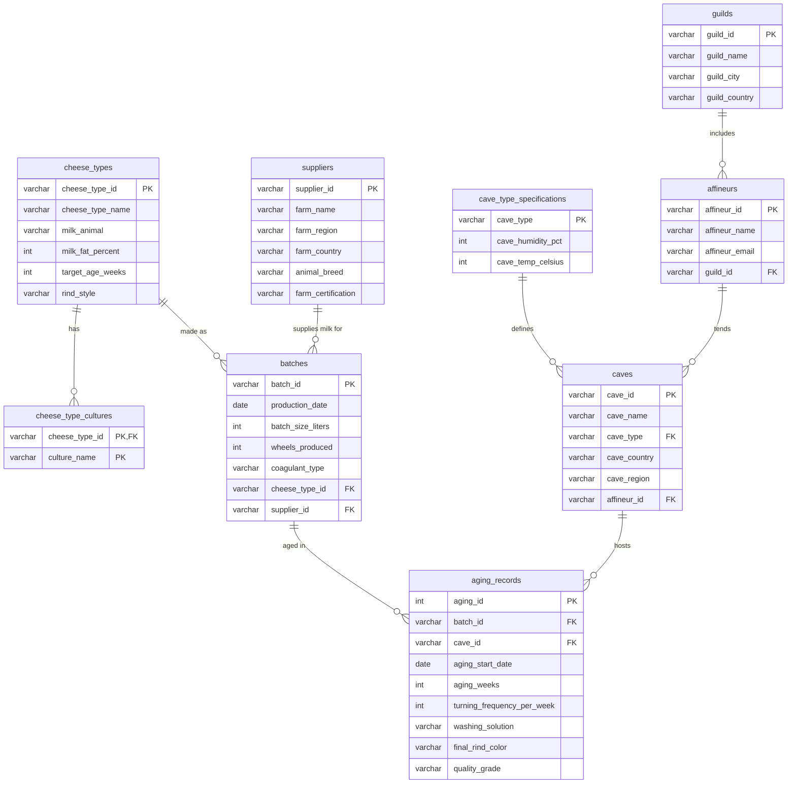

# Maison Beaumont Affinage — Cheese Aging Database & Dashboard

A normalized MySQL database and R Shiny analytics dashboard for a fictional cheese affinage (aging) brokerage. Built as the final project for **CS3200 Introduction to Databases** at Northeastern University (Summer B 2026).

The starting point is a single flat CSV export of ~36 columns covering batches of cheese, the farms that supplied the milk, the caves the cheese aged in, the affineurs who tended it, and their guilds. The project designs a 3NF schema for that data, builds it on a cloud-hosted MySQL server (Aiven), loads and validates the data from R, adds a stored procedure for new production records, and puts an interactive dashboard on top.

- **Live dashboard:** [986shh-gulnas0moshkovich.shinyapps.io/finalProjectDashboardMoshkovichG](https://986shh-gulnas0moshkovich.shinyapps.io/finalProjectDashboardMoshkovichG/)

> The dataset is synthetic and was provided by the course, so some values may be inconsistent or illogical.

## Tech stack

- **Database:** MySQL on [Aiven](https://aiven.io), connected over SSL
- **Language:** R (`RMySQL`, `DBI`, `sqldf`)
- **Dashboard:** R Shiny, `ggplot2`, `scales`
- **Hosting:** shinyapps.io

## Database design

The flat CSV was normalized into nine tables in Third Normal Form. Multi-valued fields (cultures, guild headquarters) were split out, the batch–cave many-to-many relationship goes through `aging_records`, and cave conditions that depend on cave type live in `cave_type_specifications`.



The categorical columns (milk animal, rind style, certification, cave type, coagulant, washing solution) are restricted with `CHECK` constraints. Columns get defaults where the data has gaps, and `NULL` is allowed only where a value can reasonably be missing.

## Project files

| File | What it does |
| --- | --- |
| `createDB.PractI.Moshkovich.G.R` | Creates all nine tables (`IF NOT EXISTS`) with primary keys, foreign keys, defaults, and `CHECK` constraints, in dependency order. |
| `loadDB.PractI.MoshkovichG.R` | Downloads the CSV from its URL, splits it into the normalized tables, and inserts the rows 200 at a time inside a single transaction. Rolls back if any insert fails. |
| `testDBLoading.PractI.MoshkovichG.R` | Validates the load by comparing the CSV against the database: distinct counts, first and last production dates, averages and totals, row counts, and spot checks of individual batches. Prints `PASS` / `FAIL` for each check. |
| `configBusinessLogic.PractI.MoshkovichG.R` | Creates the `storeProduct` stored procedure, which inserts a new batch, then calls it and confirms the row was added. |
| `deleteDB.PractI.MoshkovichG.R` | Drops all tables in reverse dependency order to reset the database. |
| `App.R` | The Shiny dashboard. |

## Dashboard

**Overview tab**
- Headline figures: total batches, wheels produced, cheese types, origin countries, and aging caves
- Batches started per month (trend)
- Batches by origin country
- Most-produced cheese types
- Quality grade distribution
- Batches by milk animal

**New Batch tab**
- A form for adding a new production batch. It calls the `storeProduct` stored procedure, with cheese type and supplier picked from the existing records.
- A table of the most recent batches, so you can see the new record appear

The layout is designed to fit on a single screen without scrolling.

## Running your own copy

To just use the dashboard, open the [live link](https://986shh-gulnas0moshkovich.shinyapps.io/finalProjectDashboardMoshkovichG/). No setup needed.

The steps below are only for building the project from scratch against your own database. You'll need R and your own MySQL server (an Aiven free-tier instance works).

1. Install the packages:
   ```r
   install.packages(c("RMySQL", "DBI", "sqldf", "shiny", "ggplot2", "scales"))
   ```
2. Copy `.Renviron.example` to `.Renviron` and fill in your database connection details, then restart R. `.Renviron` is git-ignored, so the password stays out of the repo.
3. The scripts embed the CA certificate for the original Aiven project's SSL connection. Replace `db_cert` in each script with your own server's CA certificate. In Aiven, you can download it from the service's overview page.
4. Run the scripts in this order:
   ```r
   source("createDB.PractI.Moshkovich.G.R")
   source("loadDB.PractI.MoshkovichG.R")
   source("testDBLoading.PractI.MoshkovichG.R")
   source("configBusinessLogic.PractI.MoshkovichG.R")
   ```
5. Launch the dashboard:
   ```r
   shiny::runApp()
   ```

To start over, run `deleteDB.PractI.MoshkovichG.R` and then repeat step 4.

## Author

Gulnas Moshkovich. CS3200, Northeastern University, Summer B 2026. Taught by Prof. Schedlbauer.
